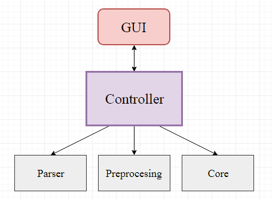

# Toxic Comment Classification (TCC)

## Введение. Цель проекта

Количество комментариев, ежедневно оставляемых пользователями в сети, огромно, и многие из них являются в той или иной степени оскорбительными. Очевидно, что в деле своевременного выявления и классификации таких сообщений сейчас не обойтись без автоматизации, поскольку она позволяет анализировать огромное количество данных за короткое время. 
Предлагаемый нами продукт поможет владельцам различных социальных платформ значительно упростить процесс проверки подозрительных пользовательских сообщений на предмет соответствия политике компании. Он хорошо подстраивается под правила конкретного сервиса, так как позволяет классифицировать, какого рода "недоброжелательность" высказана в том или ином сообщении, а также определить процентное соотношение этих видов "недоброжелательности" в исследуемом комментарии.

### Все виды "недоброжелательности", поддерживаемые на данный момент:
  * оскорбительный;
  * чрезвычайно оскорбительный;
  * непристойный;
  * угрожающий;
  * унизительный;

## Сравнение с аналогами

| Название продукта | Интерактивная обработка | Классификация содержания | GUI | Открытый исходный код | 
|-------------------|:---:|:---:|:---:|:---:|
|[**TCC**](https://github.com/grisha-feoktistov/Toxic-Comment-Classification) | **-** | **+** | **+** | **+** |
|[Perspective](http://www.perspectiveapi.com/#/) | **+** | **-** | **+** | **-** | 
|[Detecting insults](https://github.com/tuzzeg/detect_insults)| **-** | **-** | **-** | **+** |

Для простого выявления агрессивных сообщений есть большое число средств, однако, представленная работа позволяет получить более детальную информацию, полезную не только при поддержании порядка, но и при анализе аудитории ресурса.

## Требования к аппаратуре

| Пункт | Требование |
|-------------------|:---:|
|Оперативная память (RAM) | 2 ГБ и больше |
|Свободное место на жёстком диске | ~3 Мбайт |
|Процессор | не ниже Intel Celeron 1Ghz |
|Операционная система | Windows 7 и выше |

## Требования к программному обеспечению

* 64/32 bit Windows 7 или новее.

## Средства разработки программного продукта

Среда разработки:
 * MS Visual Studio
 
Система управления версиями:
 * GitHub

Языки программирования использованные в разработке:
 * С++ 11 версии
 * Python 3.6
 
Графический интерфейс:
 * QT

Тестирование:
 * QT-unit тесты (версия QT 5.7.0)
 
Средства автоматической генерации документации:
 * doxygen
 
Проверка стиля и синтексиса итогового продукта:
 * Cpp Check Code Analysis Tools версии 1.82.

## Характеристики продукта

*Расход памяти*
Размер оперативной памяти, занимаемый данным приложением, линейно зависит от размера входных данных. Тогда в худшем случае приложение будет занимать порядка 8 МБ + *"размер входного файла"*

*Производительность*
Производительность приложения логарифмически зависит от размера входных данных

*Надежность*
В случае невозможности выполнить поставленную задачу, приложение сообщает пользователю о причинах ошибки и корректно завершает работу.

## Формат входных данных

Поддерживаются два возможных формата входных данных:
  * Файл с текстом в кодировке Unicode без дополнительного оформления на английском языке. Поддерживаемые форматы файлов:
    - .txt
  * Текст в кодировке Unicode без дополнительного оформления на английском языке, введенный в специальное текстовое поле в рабочем окне программы.

Специальные возможности:
  * Возможно указать желаемый разделитель текстов в файле/текстовом поле, если они должны анализироваться незаисимо друг от друга.
  * Возможно указать желаемый идентификатор для текста выделив его парным тегом **<title> ... </title>** перед самим текстом. По умолчанию тексты идентифицируются согласно своему порядковому номеру, начиная с 1.
  
Размер входных данных никак не ограничен явно. Но он ограничен объемами оперативной памяти используемого ЭВМ.

## Формат выходных данных

Вывод данных возможен в следующих форматах: 
  * В файл в формате *.txt*.
  * В специальное поле в окне экрана.

Формат выходных данных:
  >Текст - Идентификатор текста.  
     - категория 1 - вероятность, с которой текст к ней относится  
     - категория 2 - вероятность, с которой текст к ней относится  
       ...  
     - категория n - вероятность, с которой текст к ней относится  
     
Специальные возможности:
  * Возможно включить вывод самого текста в результирующие данные. Тогда формат данных будет следующим:
  >Текст - Идентификатор текста.  
   Содержание - (сам текст).  
     категория 1 - вероятность, с которой текст к ней относится  
     категория 2 - вероятность, с которой текст к ней относится  
      ...  
     категория n - вероятность, с которой текст к ней относится  

## Установка продукта

Продукт сам по себе не требует особой установки. Возможно два варианта:
* Собрать проект из исходных файлов самостоятельно.
* Воспользоваться [уже собранными](404.com/TODO) бинарными файлами
Кроме того, возможно отдельное применение модуля анализа сентиментов в отрыве от пользовательского графического интерфейса (TODO).

## Запуск продукта

Приложение может быть запущенно из командной строки со следующим списком команд:
* input: *"путь до входного файла"*;
* output: *"путь до выходного файла"*;

Также возможен запуск графического интерфейса приложения, двойным кликом мыши по иконке приложения.

## Описание интерфейса пользователя

На изображении представленно основное окно программы. Интерфейс простой и интуитивно понятный. Пользователю доступна возможность ввести текст в специальное текстовое поле с подсказкой.Под текстовым полем находятся две кнопки: запустить и остановить процесс плучания результата. Результат после успешного завершения вычислений будет выведен в правую часть окна таблицей, как показано на изображении.

При выборе различных вкладок вверху окна, будут открываться всплывающие окна с помощью которых можно будет выбрать загружаемый файл/используемую модель ядра/посмотреть подробное описание работы.

## Описание API библиотеки

| Модуль | Функциональность |
|:---:|---|
|GUI| Отображение графических элементов, передача данных от пользователя на обработку и вывод результата |
|Parser| Чтение данных из входного потока|
|Preprocessor| Предобработка текста |
|Core| Непосредственная обработка данных и получение искомых оценок |

Воедино работу модулей связывает класс Controller, отвечающий за передачу данных в виде, пригодном для обработки следующим модулем. 

## Детали реализации

  * **Данные передобрабатываются** с помощью стандартных процедур, таких как стемминг, выявление ключевых слов и анализ частоты их употребления.
  * **Ядро** приложения основывается на байесовской фильтрации в сочетании с реккурентной нейронной сетью.

## Тестирование

Корректная работа модулей и связей между ними была проверена модульными и интеграционными тестами с использованием соответствующих возможностей фреймворка QT. Юнит тесты были реализованы посредством инструмента QTest.
Код приложения успешно прошёл проверку cppcheck.

## Ссылки и литература
* Tajinder Singh, Madhu Kumar, ["Role of Text Pre-Processing in Twitter Sentiment Analysis"](https://www.sciencedirect.com/science/article/pii/S1877050916311607), 2016
* Richard Socher, Alex Perelygin, Jean Y. Wu, Jason Chuang, Christopher D. Manning, Andrew Y. Ng and Christopher Potts, ["Recursive Deep Models for Semantic Compositionality Over a Sentiment Treebank"](https://nlp.stanford.edu/~socherr/EMNLP2013_RNTN.pdf), 2013
* Серия статей "Another Twitter sentiment analysis" [(часть 1)](https://towardsdatascience.com/another-twitter-sentiment-analysis-bb5b01ebad90)

